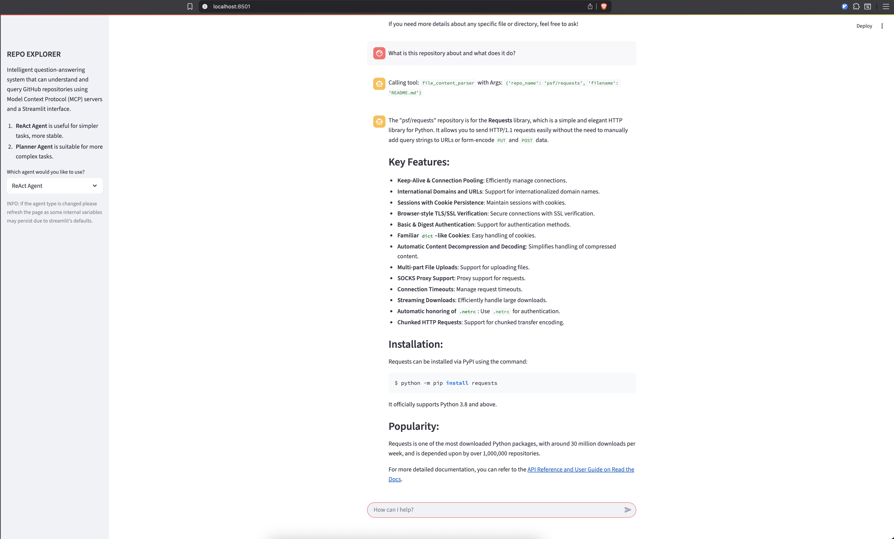

# Rex - Repo-Explorer 🎛️

**A modular, general-purpose agent built with LangGraph, MCP, and LangSmith — demonstrated via GitHub code analysis.**

---

## 🚀 What It Does

Repo-Explorer is a **Plan‑and‑Execute agent** architecture built from scratch using **LangGraph**, instrumented via **MCP servers**, with **LangSmith tracing**, and a Streamlit-based UI.

Key capabilities:
- Multi-step reasoning via custom **planner** → **executor** → **replanner** → **finalizer** pipeline (see [`rex_flow.png`](./rex_flow.png)).
- Tool-agnostic design: supports GitHub code exploration today, but can be applied to any domain by swapping MCP endpoints.
- Context-aware: uses context summarization and selective message passing to reduce token usage.
- Observability-ready: full tracing enabled via **LangSmith** (`LANGCHAIN_TRACING_V2=true`).
- Benchmark-ready: metrics captured for latency and token consumption.

---

## 🧩 Architecture Overview

- **Planner Node**: generates step-by-step plan from user input.
- **Executor Node** (React agent): calls MCP-based tools to complete each step.
- **Replanner**: adapts plan based on what’s already known or executed.
- **Finalizer**: summarizes results and optionally compresses context for next turn.

Each node updates the `AgentState`. The architecture is fully described in [`rex_flow.png`](./rex_flow.png) and the high-level system in [`images/Overview.png`](images/Overview.png):



---

## Features

- **Conversational Q&A**: Chat with the system to ask questions about any GitHub repository.
- **Multiple Agent Types**: Choose between ReAct, Planner, and Upgraded Planner agents for simple or complex tasks.
- **MCP Tool Integration**: Access repository structure, file contents, commit history, issues/PRs, code search, documentation, and more via MCP servers.
- **Advanced Code Analysis**: Summarize, analyze, and explain code, dependencies, and recent changes.
- **Streamlit UI**: Clean, chat-like interface with conversation history and tool usage display.
- **Extensible**: Easily add new MCP tools or agent types.
- **LangSmith Tracing**: Full observability and debugging with LangSmith.
- **Metrics**: Latency and token usage tracking for benchmarking.

---

## Installation & Setup

1. **Install [uv](https://docs.astral.sh/uv/getting-started/installation/)** (for fast Python dependency management):
   ```sh
   uv venv
   source .venv/bin/activate
   uv pip install
   ```
2. **Install Streamlit and other dependencies** (if not using uv):
   ```sh
   pip install -r requirements.txt  # or see pyproject.toml for dependencies
   ```
3. **Run the Streamlit app:**
   ```sh
   streamlit run main.py
   ```

---

## Usage

- Launch the app and select your preferred agent in the sidebar.
- Enter your question or task in the chat input (e.g., "Show me all functions related to authentication").
- The agent will analyze the repository, call MCP tools as needed, and respond in the chat.
- Tool usage and conversation history are displayed for transparency.

---

## Supported MCP Tools

- **File Content Server**: Retrieve and read file contents
- **Repository Structure Server**: Get directory trees and file listings
- **Commit History Server**: Access commit messages and changes
- **Issue/PR Server**: Query issues and pull requests
- **Code Search Server**: Search for specific code patterns or functions
- **Documentation Server**: Extract and process README files and docs

---

## Example Questions

- What is this repository about and what does it do?
- Show me the main entry points of this application
- What are the recent changes in the last 10 commits?
- Find all functions related to authentication
- What dependencies does this project use?
- Are there any open issues related to performance?
- Explain how the database connection is implemented
- What's the testing strategy used in this project?

---

## Contributing

Contributions are welcome! Please open issues or pull requests for bug fixes, new features, or improvements.

---

## License

This project is licensed under the MIT License. See [LICENSE](LICENSE) for details.
