# Rex - Repo-Explorer 🎛️

**A modular, general-purpose agent built with LangGraph, MCP, and LangSmith — demonstrated via GitHub code analysis.**

## 🚀 What It Does

Repo-Explorer is a **Plan‑and‑Execute agent** architecture built from scratch using **LangGraph**, instrumented via **MCP servers**, with **LangSmith tracing**, and a Streamlit-based UI.

Key capabilities:
- Multi-step reasoning via custom **planner** → **executor** → **replanner** → **finalizer** pipeline (see [`rex_flow.png`](images/rex_flow.png)).
- Tool-agnostic design: supports GitHub code exploration today, but can be applied to any domain by swapping MCP endpoints.
- Context-aware: uses context summarization and selective message passing to reduce token usage.
- Observability-ready: full tracing enabled via **LangSmith** (`LANGCHAIN_TRACING_V2=true`).
- Benchmark-ready: metrics captured for latency and token consumption.

## 🧩 Architecture Overview

Repo-Explorer uses a sophisticated multi-agent architecture with the following components:

### Core Architecture Flow

```mermaid
flowchart TD
 subgraph subGraph0["Agent State Management"]
        S1["📦 State: Task, Messages, Plan, Tools"]
        S3["📦 State: + Tool Results"]
        S4["📦 State: + Updated Plan"]
        S5["📦 State: + Final Output"]
  end
 subgraph subGraph1["MCP Tools"]
        T["🧰 MCP Tools"]
  end
     A["👤 User Input"] --> B["📝 Planner Node"]
     B --> C["📋 Plan Generation"]
     C --> D["🧠 Summarizer Node"]
     D --> E["📝 Context Summary"]
     E --> F["🤖 Executor Node (React Agent)"]
     F --> G1["🔧 Tool Call 1"] & G2["🔧 Tool Call 2"] & GN["🔧 Tool Call N"]
     G1 --> H["📊 Results Collection"]
     G2 --> H
     GN --> H
     H --> I["🔄 Replanner Node"]
     I --> J["📝 Updated Plan"] & K["✅ Finalizer Node"]
     J --> F
     K --> L["💬 Final Response"]
     L --> M["🏁 END"]
     A -.-> S1
     H -.-> S3
     I -.-> S4
     K -.-> S5
     F -.-> T
```



> **📋 Detailed Architecture**: For a comprehensive view of the system architecture, see [`rex_flow.png`](images/rex_flow.png).

### Agent Types

#### 🤖 React Agent
- **Purpose**: Simple, fast execution for straightforward tasks
- **Best for**: Direct tool calls, quick queries, cost-effective operations
- **Flow**: Direct tool execution with minimal planning overhead

#### 📋 Planner Agent  
- **Purpose**: Complex multi-step reasoning and analysis
- **Best for**: Detailed repository analysis, code exploration, comprehensive summaries
- **Flow**: Plan → Execute → Replan → Finalize pipeline

## Features

- **Conversational Q&A**: Chat with the system to ask questions about any GitHub repository.
- **Multiple Agent Types**: Choose between React and Planner agents for different task complexities.
- **MCP Tool Integration**: Access repository structure, file contents, commit history, issues/PRs, code search, and more via MCP servers.
- **Advanced Code Analysis**: Summarize, analyze, and explain code, dependencies, and recent changes.
- **Streamlit UI**: Clean, chat-like interface with conversation history and tool usage display.
- **Extensible**: Easily add new MCP tools or agent types.
- **LangSmith Tracing**: Full observability and debugging with LangSmith.
- **Metrics**: Latency and token usage tracking for benchmarking.

## 📦 Installation & Quick Start

### Prerequisites

- **Python 3.13+** (required by the project)
- **Git** (for repository cloning)
- **OpenAI API Key** (for LLM interactions)
- **LangSmith API Key** (optional, for tracing and debugging)

### Setup

1. **Clone and navigate to the repository:**
   ```sh
   git clone <repository-url>
   cd repo-explorer
   ```

2. **Set up environment variables:**
   ```sh
   cp .envrc.example .envrc
   ```
   
   Edit `.envrc` with your API keys:
   ```sh
   export OPENAI_API_KEY='your_openai_api_key_here'
   export LANGSMITH_TRACING="true"
   export LANGSMITH_ENDPOINT="https://api.smith.langchain.com"
   export LANGSMITH_API_KEY="your_langsmith_api_key_here"
   export LANGSMITH_PROJECT="your_project_name_here"
   ```

3. **Load environment variables:**
   ```sh
   source .envrc
   ```

### Installation Options

#### Option 1: Using uv (Recommended)

```sh
uv venv
source .venv/bin/activate
uv pip install
```

#### Option 2: Using pip

```sh
python -m venv .venv
source .venv/bin/activate  # On Windows: .venv\Scripts\activate
pip install -r requirements.txt
```

### Run the Application

```sh
streamlit run main.py
```

Open your browser to `http://localhost:8501` and start exploring! Try asking: "What is this repository about?"

## 💡 Usage

- **Launch the app** and select your preferred agent in the sidebar:
  - **React Agent**: Useful for simpler tasks, cheaper and faster
  - **Planner Agent**: Suitable for more complex tasks requiring detailed analysis
- **Enter your question** or task in the chat input (e.g., "Show me all functions related to authentication").
- **Watch the agent work** as it analyzes the repository, calls MCP tools as needed, and responds in the chat.
- **Review tool usage** and conversation history displayed for transparency.

## 🛠️ Supported MCP Tools

- **Repository Management**: Clone and manage GitHub repositories locally
- **File Content Parser**: Retrieve and fetch contents of specific files
- **Repository Structure**: Get directory trees and file listings
- **Code Search**: Search for specific code patterns or functions across the repository
- **Commit History**: Access recent commits with diffs and changes
- **Issues & PRs**: Query recent issues and pull requests from GitHub

## ❓ Example Questions

- What is this repository about and what does it do?
- Show me the main entry points of this application
- What are the recent changes in the last 10 commits?
- Find all functions related to authentication
- What dependencies does this project use?
- Are there any open issues related to performance?
- Explain how the database connection is implemented
- What's the testing strategy used in this project?

## 🔧 Troubleshooting

### Common Issues

**Q: "Module not found" errors**
- Ensure you're using Python 3.13+
- Make sure you've activated your virtual environment
- Try reinstalling dependencies: `uv pip install --force-reinstall`

**Q: "OpenAI API key not found"**
- Check that your `.envrc` file is properly configured
- Ensure you've sourced the environment: `source .envrc`
- Verify your OpenAI API key is valid and has sufficient credits

**Q: "Streamlit not found"**
- Install Streamlit: `pip install streamlit` or `uv pip install streamlit`
- Ensure you're running from the project root directory

**Q: "LangSmith tracing not working"**
- LangSmith is optional - the app works without it
- If you want tracing, ensure your LangSmith API key is valid
- Check that `LANGSMITH_TRACING="true"` is set in your `.envrc`

## 🤝 Contributing

Contributions are welcome! Please open issues or pull requests for bug fixes, new features, or improvements.

### Development Setup

1. Fork the repository
2. Create a feature branch: `git checkout -b feature/amazing-feature`
3. Make your changes and test thoroughly
4. Commit your changes: `git commit -m 'Add amazing feature'`
5. Push to the branch: `git push origin feature/amazing-feature`
6. Open a Pull Request

## 📄 License

This project is licensed under the MIT License. See [LICENSE](LICENSE) for details.
